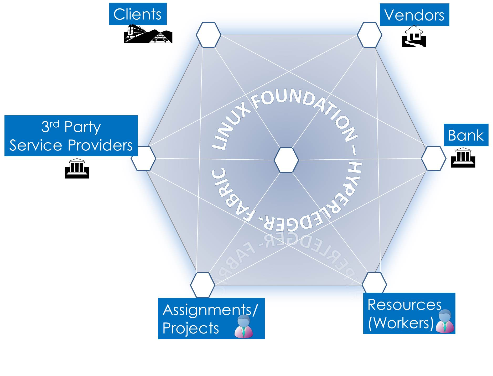

# Timesheet Management on the Blockchain
Contributors: Alex Rosen, Nishi Nidamarty, Ratnakar Asara, Ramesh Thoomu, Mohan Venkataraman
## Introduction
The Hyperledger/Fabric is an implementation of blockchain technology, leveraging familiar and proven technologies. It is a modular architecture allowing pluggable implementations of various function. It features powerful container technology to host any mainstream language for smart contracts development. Chaincode (smart contracts) or blockchain applications run on the fabric. Chaincode is written in Go language

The original intention of this application is to understand how to write a Go application on the Hyperledger/Fabric. This initial version was written to understand the different chaincode api's, the boundary that separates what goes into the blockchain and what lives within the enterprise application, usage of database features, error management etc.

## Application Description

This application deals with Workforce and timesheet management on the block chain. The blockchain makes sense here as there are many different stakeholders and can leverage the benifits of the "Network Effect". This application deals with the following stake holders:

* Clients such as IBM, MCI, MetLife
* Banks
* Vendors such as IT People, Insight Global, Signature Consultants etc.
* Projects and Assignment Managers
* 3rd Party Service providers such as ADP, Fidelity
* Resources such as Freelance Consultants, Office operators such as Regis etc.

The Blockchain registers all the **stakeholders** after validating them against a "IDaaS" chain. **Vendors** seek **Clients** and **assign** employees or **Resources** to work on them i.e. Assignments or Projects. They agree to a certain bill rate, travel and lodging expenses and paid time-offs. 

As resources work on projects, they enter their **time** which is recorded on Blockchain. The distributed trust mechanism ensures that stakeholders agree to the work performed and the time charged. At the end of each month, **Billing Calculations** can be made. Vendors would initiate calculations to produce the monthly bill for each cleint for each worker. Similarly, clients can initiate billing to show how different resources from mulriple vendors charged to the project or assignment. In this sample application, a Worker can work on many projects within or across clients.

The typical business process is shown below

## Chain Code APIs
**Invoke Functions**

                PostWorker
                AssignWorker
                PostTime
                CalculateMonthlyBill

**Query Functions**

                GetWorker
                GetAssignment
                GetTSForDay
                GetWorkerListAtClient
                GetTSForMonthByDateAndWorker
                GetTSForMonthByWorker
                GetTimeSheet
                GetTimeSheetForMonth
                GetTSByDate
                GetBillForMonth
## Environment

Please review instructions on setting up the [Development Environment](https://github.com/hyperledger/fabric/blob/master/docs/dev-setup/devnet-setup.md) as well as the setting up the [Sandbox Environment](https://github.com/hyperledger/fabric/blob/master/docs/API/SandboxSetup.md) to execute the chaincode.

### Cloning the Application
 * cd $GOPATH/src/github.com/hyperledger/fabric
 * git clone https://github.com/<user-name>/timesheet.git

## Running the Chaincode
## Open Issues
